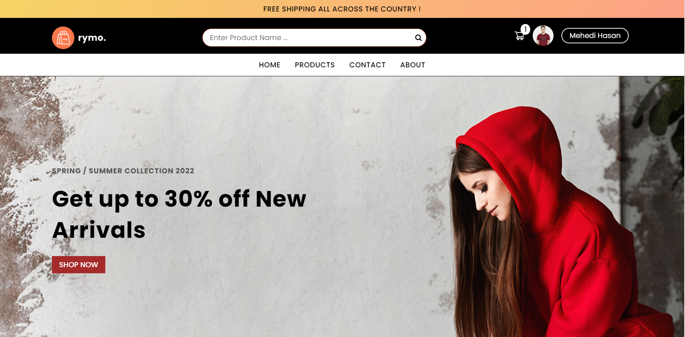
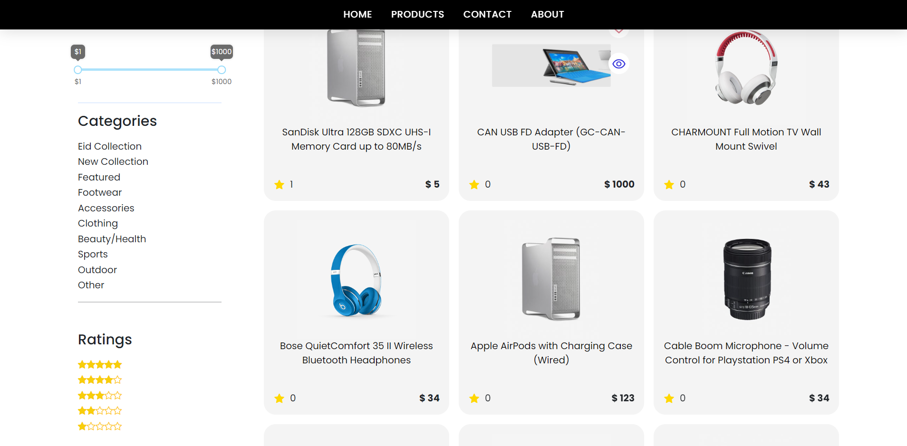
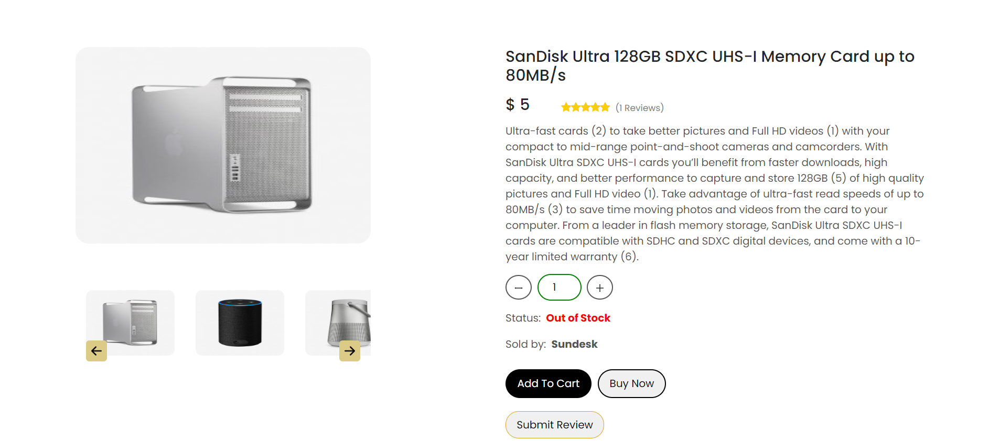
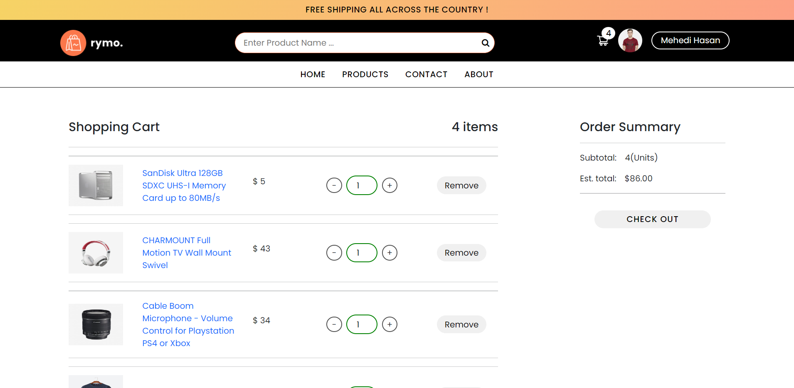
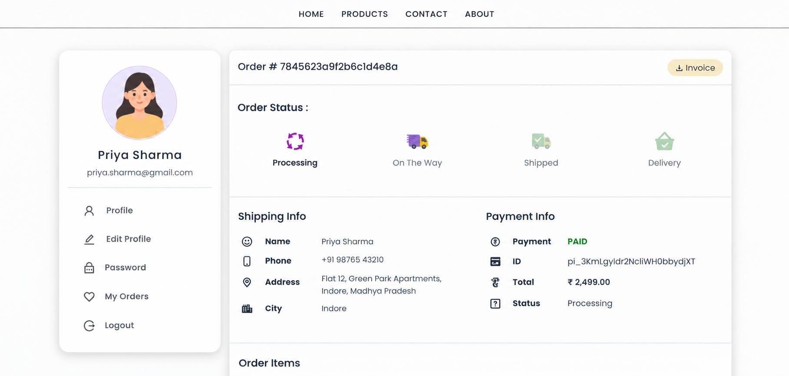

# 🛒 MERN Stack Full-Stack E-Commerce Application

A full-stack E-Commerce web application built using the **MERN stack** with secure authentication, product management, shopping cart, order processing, reviews, admin dashboard, and online payment integration.

This project demonstrates the implementation of a complete e-commerce workflow, from browsing and filtering products to cart management, checkout, order tracking, and administration.

## 🚀 Features

* 🛍️ Fully functional E-Commerce website built using the MERN stack
* ⚛️ React.js for building the user interface
* 🔄 Redux for global state management
* 🔐 Secure authentication using cookies
* 👤 User authentication and authorization
* 🛠️ Complete Admin Dashboard
* 📦 Admin product management
* 👥 Admin user management
* 🧾 Admin order management
* ⭐ Product ratings and reviews system
* 🛒 Complete shopping cart functionality
* 💳 Checkout and online payment integration using Stripe
* 🖼️ Cloudinary integration for product image uploads
* 🔎 Product search and filtering
* 📄 Pagination for product listings
* 📦 Order creation and order details
* 📊 Admin order and product management

## 🧑‍💻 Tech Stack

### Frontend

* React.js
* Redux
* JavaScript
* HTML5
* CSS3

### Backend

* Node.js
* Express.js
* REST APIs

### Database

* MongoDB

### Authentication & Security

* Cookie-based Authentication
* Authorization

### Third-Party Services

* Cloudinary — Image Upload & Management
* Stripe — Payment Processing

### Development Tools

* Git
* GitHub
* VS Code

## 📸 Screenshots

### 🏠 Homepage



### 🛍️ Product Page



### 📋 Product Details Page



### 🛒 Cart Page



### 📦 Order Details



## ⚙️ Installation & Setup

### 1. Clone the repository

```bash
git clone https://github.com/Mantsha275/Ecommerce-app-mern.git
```

### 2. Navigate to the project directory

```bash
cd Ecommerce-app-mern
```

### 3. Install dependencies

Install the backend dependencies:

```bash
npm install
```

If the frontend has a separate package.json, navigate to the frontend directory and install its dependencies as well.

### 4. Configure environment variables

Create a `.env` file and add the required environment variables for:

* MongoDB connection
* JWT / authentication
* Cloudinary
* Stripe
* Other application configuration

### 5. Start the application

Run the development server using the project's configured npm script.

```bash
npm run dev
```

## 👨‍💻 Author

**Mantsha275**

GitHub:
https://github.com/Mantsha275

Repository:
https://github.com/Mantsha275/Ecommerce-app-mern

---

⭐ If you find this project useful, consider giving the repository a star!
